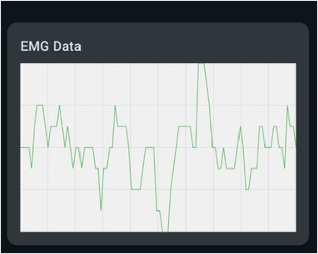
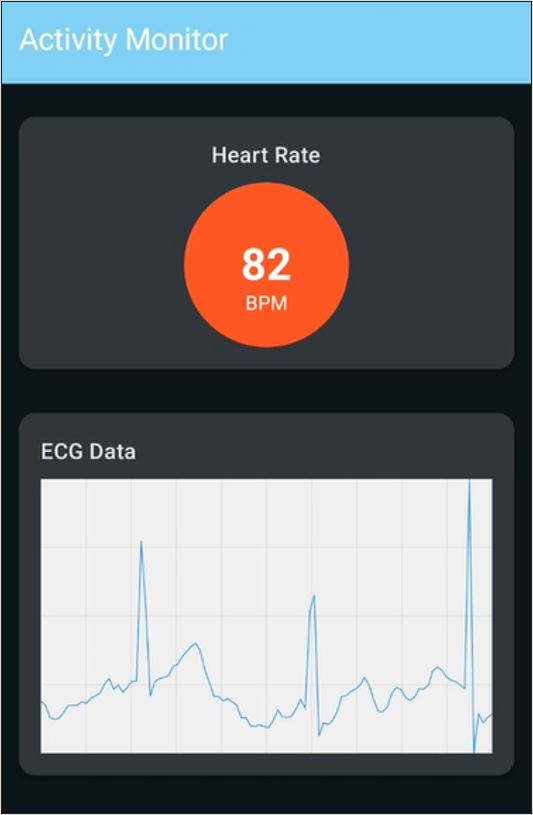
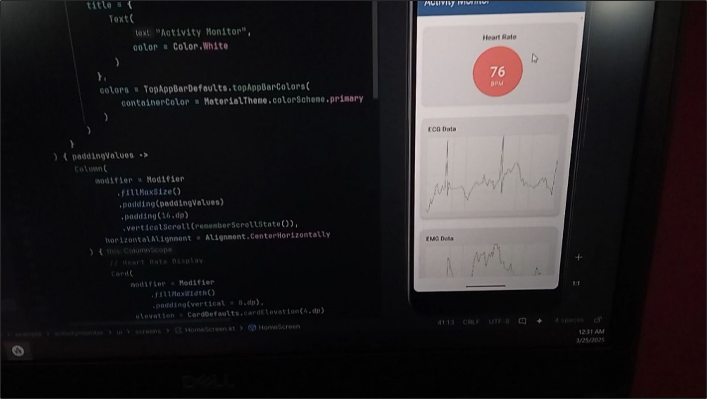

# Activity Monitor

Real-time Android app to visualize biosignals—ECG, EMG, and Heart Rate—from Firebase Realtime Database using Jetpack Compose and the MVVM pattern.

## Overview
- Streams live data from Firebase Realtime Database at the following keys:
  - `ecg/latest` → JSON string containing an array of integer samples + timestamp
  - `emg/latest` → JSON string containing an array of integer samples + timestamp
  - `heartrate/latest` → JSON string containing a numeric BPM value + timestamp
- Renders custom Compose Canvas charts for ECG and EMG.
- Displays Heart Rate with an animated “pulse” indicator.
- Material 3 with dynamic color theming.

> Note: The app’s UI theme and `MainActivity` are annotated with `@RequiresApi(Build.VERSION_CODES.S)`. Practically, this means you should run the app on Android 12 (API 31) or later unless you remove the API requirement or gate dynamic color on runtime checks.

## Screenshots

| EMG | ECG | Running |
|---|---|---|
|  |  |  |

## Tech Stack
- Android, Kotlin, Jetpack Compose (Material 3)
- MVVM: `ViewModel` + `StateFlow`
- Firebase Realtime Database (KTX)
- Coroutines / Flows

## Project Structure
```
app/
  src/main/java/com/example/activitymonitor/
    MainActivity.kt                  # Sets up Compose and injects ViewModel
    viewmodel/MainViewModel.kt       # Collects flows and exposes StateFlow
    data/
      models/                        # ECGData, EMGData, HeartRateData
      repository/SensorRepository.kt # Firebase listeners → Flows (callbackFlow)
    ui/
      screens/HomeScreen.kt          # Top-level screen layout
      components/                    # ECGChart, EMGChart, HeartRateDisplay
      theme/                         # Material 3 theme & typography
  src/main/AndroidManifest.xml       # App manifest
  google-services.json               # Firebase config (add your own)
```

## Architecture
- **Repository** (`SensorRepository`):
  - Subscribes to Firebase Realtime Database using `ValueEventListener`.
  - Emits domain models over `Flow` using `callbackFlow`.
- **ViewModel** (`MainViewModel`):
  - Collects repository flows and exposes `StateFlow<ECGData>`, `StateFlow<EMGData>`, and `StateFlow<HeartRateData>` for the UI.
- **UI (Compose)**:
  - `HomeScreen` collects state and renders 3 sections: Heart Rate, ECG chart, EMG chart, plus a last-updated timestamp.
  - Charts are implemented with Compose `Canvas` (no charting library required at runtime).

Data flow:
Firebase → `SensorRepository` (callbackFlow) → `MainViewModel` (StateFlow) → Compose UI (collectAsState)

## Firebase Setup
1. Create a Firebase project and enable Realtime Database.
2. Add an Android app with package name `com.example.activitymonitor` (or change `applicationId` in `app/build.gradle.kts` to match your package, then download a new config).
3. Download `google-services.json` from the Firebase Console and place it at `app/google-services.json`.
4. Ensure Realtime Database contains the following keys with JSON string values (note: string values containing JSON, not raw objects):

```json
// ecg/latest → type: string (the value shown below as a single JSON string)
{"data": [100, 120, 98, 130, 110], "timestamp": 1710000000000}

// emg/latest → type: string
{"data": [12, 20, 15, 22, 18], "timestamp": 1710000000123}

// heartrate/latest → type: string
{"value": 72, "timestamp": 1710000000456}
```

- The repository expects the database leaf value to be a string that contains JSON. If you prefer using native objects in Realtime Database, adjust `SensorRepository` to parse from `snapshot.getValue(Map::class.java)` (or a data class) instead of a JSON string.

## Requirements
- Android 12 (API 31) or later for current code (due to `@RequiresApi(S)`).
- Android Gradle Plugin via Version Catalog (`agp` currently `8.9.0`).
- Gradle wrapper included; recommended JDK 17 for the build (project’s Kotlin/JVM targets are 11).
- Android SDK with `compileSdk = 35`, `targetSdk = 35`, `minSdk = 29`.

## Build & Run
### Option A: Android Studio
- Open the project in Android Studio (latest stable recommended).
- Ensure your `google-services.json` is in `app/`.
- Sync Gradle, select a device/emulator on API 31+, and Run.

### Option B: Gradle (Windows PowerShell)
```powershell
# From the project root
.\gradlew.bat clean :app:assembleDebug
.\gradlew.bat :app:installDebug
```
Then launch the app on a connected device/emulator (API 31+).

## Configuration
- `applicationId`: Set in `app/build.gradle.kts`. Must match the Firebase app config used to generate `google-services.json`.
- Compose Compiler: Defined in `composeOptions { kotlinCompilerExtensionVersion = "1.4.0" }`.
  - If you see Kotlin/Compose compatibility errors, align Kotlin plugin and Compose Compiler versions (see Jetpack Compose release notes) and/or update the version catalog (`gradle/libs.versions.toml`).
- Firebase BoM: `com.google.firebase:firebase-bom:31.5.0`. You can update to a more recent BoM if needed.

## Testing
- JVM unit tests:
```powershell
.\gradlew.bat test
```
- Instrumented tests (device/emulator required):
```powershell
.\gradlew.bat connectedAndroidTest
```

## Troubleshooting
- No data on charts:
  - Verify Realtime Database paths: `ecg/latest`, `emg/latest`, `heartrate/latest`.
  - Ensure each path’s value is a JSON string with the expected fields.
  - Check network/security rules and that your device has internet access.
- App doesn’t start on API < 31:
  - Current code uses `@RequiresApi(S)` and dynamic color. Run on Android 12+ or remove the requirement and guard dynamic color by `Build.VERSION.SDK_INT` checks.
- Build fails with Compose/Kotlin mismatch:
  - Align Kotlin plugin and Compose Compiler versions. Update `libs.versions.toml` and `composeOptions` accordingly.
- Firebase config errors:
  - Ensure `google-services.json` is present under `app/` and the `applicationId` matches your Firebase app package.

## Roadmap / Ideas
- Persist historical samples and enable zoom/pan on charts.
- Migrate to typed Firebase objects instead of JSON strings.
- Integrate alerting (e.g., abnormal HR detection) and export/sharing.
- Remove unused chart libraries if not needed (`MPAndroidChart`, `plot`).

## License
This project is licensed under the Apache License 2.0 — see the [LICENSE](LICENSE) file for details.